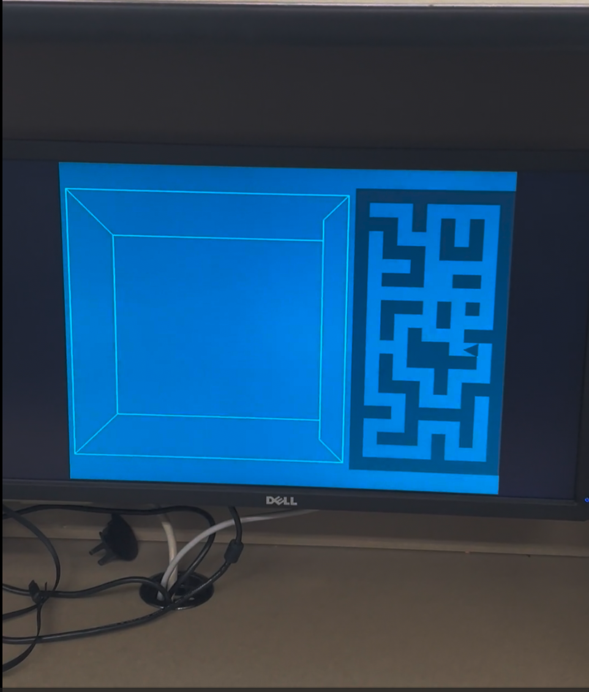

# FPGA Maze Game (Verilog)

A hardware-based, tile-based maze exploration game inspired by *Wayout (1982)*, implemented entirely in **Verilog** on an **Altera DE1-SoC FPGA**. The project features real-time VGA graphics and fully synchronous movement and collision logic implemented directly at the hardware level.

---

## ⚠️ Academic Integrity Notice
To comply with university academic integrity policies:
- **Source code is not included**
- **Only the compiled FPGA bitstream (.sof) is provided**
- This allows the project to be demonstrated on hardware without exposing implementation details

---

## 🎮 Game Overview
- **Resolution:** 640×480 (VGA)
- **Refresh Rate:** 60 Hz (25 MHz pixel clock)
- **Input:** On-board pushbuttons KEY[4:1]
- **Output:** VGA Monitor
- **Gameplay:** Tile-based movement with real-time wall collision detection

The player moves one tile per input, ensuring deterministic and stable motion with precise collision handling.

---

## 🛠 Hardware Requirements
- **FPGA Board:** DE1-SoC (Cyclone V – 5CSEMA5F31C6)
- **VGA Monitor:** 640×480 support
- **On-board pushbuttons KEY[4:1]**
- **USB-Blaster**

> The provided `.sof` file is device-specific and will not run on other boards without recompilation.

---

## 📥 Loading the Game
1. Download the `.sof` file from output_files folder
2. Connect the FPGA via USB-Blaster
3. Open **Quartus Prime Programmer** under the tab **Programmer**
4. Select **Hardware Setup** and then USB-Blaster
5. Add the `mazegame.sof` file and check **Program/Configure** 
6. Click **Start**

---

## 🕹 Controls
| Key | Action |
|----|--------|
| KEY[4] | Move Left |
| KEY[3] | Move Right |
| KEY[2] | Move Forward |
| KEY[1] | Move Backward |
| KEY[0] | Game reset (Active Low)) |

---

## 🚀 Architecture Highlights
- **Custom VGA Controller:** Generates 640×480 timing and pixel output
- **Maze ROM:** Bit-mapped tile storage for walls and paths
- **Tile-Based Movement Engine:** One-step-per-input logic with collision checks
- **Button Input Handling:** Debounced, synchronous processing of on-board pushbuttons
- **Controlled Redraw Logic:** Prevents residual pixels and rendering artifacts

---

## 🧠 Control Logic
A finite state machine coordinates reset, idle, and movement states, ensuring deterministic timing, reliable input handling, and predictable hardware behavior.

---

## 📌 Engineering Focus
This project demonstrates real-time digital design, FPGA graphics pipelines, synchronous control logic, and hardware-level debugging—skills directly applicable to embedded systems and FPGA-based development.

---

### 🎥 Live Demo

| VGA Monitor View |
|-----------------|
|  |
